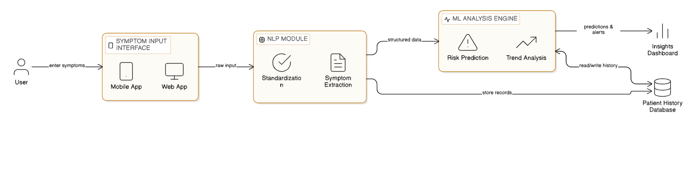

# System Architecture – MediTrack

## Overview
MediTrack is an intelligent patient health monitoring system designed to analyze user-reported symptoms over time using NLP and ML techniques.

## System Flow
1. Users enter symptoms via a mobile or web interface.
2. Raw symptom input is passed to the NLP module.
3. The NLP module performs symptom standardization and extraction.
4. Structured data is forwarded to the ML analysis engine.
5. The ML engine performs risk prediction and trend analysis.
6. Patient data is stored in the patient history database.
7. Insights and alerts are visualized via a dashboard.

## Design Objective
The architecture supports longitudinal learning and personalized health insights based on patient history.
